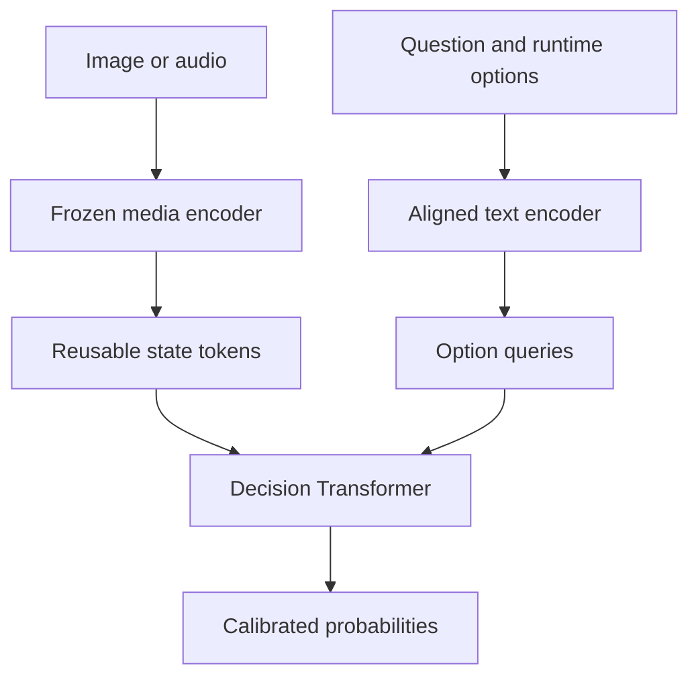

# Laya Multimodal

Fast, schema-driven decisions over images and audio without autoregressive decoding.

Laya Multimodal encodes a media item once, scores runtime-defined answer options directly, and returns calibrated probability distributions. It provides:

- a zero-training SigLIP2 image baseline;
- a zero-training CLAP audio baseline;
- dynamic `choice`, `binary`, and ordinal `score` questions;
- reusable and disk-cacheable media states;
- a trainable option-query Transformer with image-patch cross-attention;
- proper-scoring-rule losses, temperature calibration, abstention, and metrics;
- MPS support for training on Apple Silicon.

This is an independent experimental project. It is not affiliated with or derived from Laya; it explores how the same general class of non-generative, dynamic decision systems can operate on media.

## Architecture



The expensive encoder is deliberately separated from decision answering:

```python
state = engine.encode("incident.jpg")  # expensive, once
first = engine.ask(state, first_questions)  # cheap
later = engine.ask(state, more_questions)  # reuses the same state
```

V0 uses aligned global embeddings and requires no training. V1 adds a small shared head: option queries first attend to one another, then cross-attend into media tokens. Its output is a learned residual over the V0 logits, so training starts from the usable zero-shot model.

## Install

Python 3.10–3.12 is supported.

```bash
python -m venv .venv
source .venv/bin/activate
pip install -e '.[audio,train]'
```

On an Apple Silicon Mac, PyTorch automatically uses MPS when `device="auto"`. If an operation lacks an MPS kernel, enable CPU fallback:

```bash
export PYTORCH_ENABLE_MPS_FALLBACK=1
```

The default checkpoints are Apache-2.0-licensed `google/siglip2-base-patch16-224` and `laion/clap-htsat-fused`. Their weights are downloaded from Hugging Face on first use.

## Zero-shot image decisions

```python
from laya_multimodal import DecisionEngine, Question
from laya_multimodal.encoders import SiglipVisionEncoder

engine = DecisionEngine(
    SiglipVisionEncoder(device="auto"),
    abstain_below=0.45,
)

questions = [
    Question.choice(
        "vehicle",
        "What type of vehicle is most prominent?",
        {
            "car": "a passenger car",
            "van": "a van or minibus",
            "truck": "a lorry or truck",
            "motorcycle": "a motorcycle",
        },
    ),
    Question.binary(
        "damaged",
        "Is the main vehicle visibly damaged?",
        positive="the main vehicle has visible damage",
        negative="the main vehicle has no visible damage",
    ),
    Question.score(
        "severity",
        "How severe is the visible vehicle damage?",
        ["none", "minor cosmetic damage", "moderate damage", "major structural damage"],
    ),
]

state = engine.encode("vehicle.jpg")
answers = engine.ask(state, questions)
print({key: answer.to_dict() for key, answer in answers.items()})
```

For a score card, `score` is the expected zero-based level, not merely the winning level.

## Zero-shot audio decisions

```python
from laya_multimodal import DecisionEngine, Question
from laya_multimodal.encoders import ClapAudioEncoder

engine = DecisionEngine(ClapAudioEncoder(device="auto"))
answers = engine.predict(
    "recording.wav",
    [
        Question.choice(
            "sound",
            "What is the dominant sound?",
            ["human speech", "dog barking", "traffic", "music", "construction"],
        ),
        Question.binary(
            "speech",
            "Is intelligible human speech present?",
            positive="intelligible human speech is present",
            negative="no intelligible human speech is present",
        ),
    ],
)
```

CLAP V0 uses a global audio representation. The shared head accepts token sequences, but the initial CLAP adapter supplies one global token because Transformers does not expose a stable time-token contract for HTS-AT across versions. A future BEATs adapter can add fine-grained time tokens without changing the public API.

## CLI

Questions may be a mapping or a list in JSON:

```json
{
  "vehicle": {
    "type": "choice",
    "prompt": "What type of vehicle is most prominent?",
    "options": {
      "car": "a passenger car",
      "van": "a van or minibus",
      "truck": "a lorry or truck"
    }
  }
}
```

Run the zero-shot image model:

```bash
laya-mm predict \
  --modality image \
  --device mps \
  --questions questions.json \
  --cache-dir .cache/laya-multimodal \
  vehicle.jpg
```

Save a reusable state explicitly:

```bash
laya-mm encode --modality image --device mps photo.jpg --output photo.safetensors
```

## Train the decision head

Training data is JSON Lines. Paths are resolved relative to the JSONL file:

```json
{"media":"images/001.jpg","question":{"id":"animal","type":"choice","prompt":"What animal is prominent?","options":{"dog":"a dog","cat":"a cat","horse":"a horse"}},"target":"dog"}
{"media":"images/002.jpg","question":{"id":"damage","type":"score","prompt":"How severe is the damage?","options":["none","minor","moderate","major"]},"target_distribution":{"0":0.0,"1":0.1,"2":0.8,"3":0.1}}
```

Train only the small head while the media and text encoders remain frozen:

```bash
PYTORCH_ENABLE_MPS_FALLBACK=1 laya-mm train \
  --modality image \
  --device mps \
  --dataset data/train.jsonl \
  --output checkpoints/vision-head \
  --cache-dir .cache/laya-multimodal \
  --epochs 10 \
  --batch-size 8 \
  --loss log
```

Options are shuffled independently during training by default. Available differentiable proper-score objectives are `log`, `brier`, `spherical`, and ordinal `rps`.

Fit temperature on a separate validation set, then evaluate on a test set:

```bash
laya-mm calibrate \
  --modality image --device mps \
  --checkpoint checkpoints/vision-head \
  --dataset data/validation.jsonl \
  --output checkpoints/vision-head/calibration.json

laya-mm evaluate \
  --modality image --device mps \
  --checkpoint checkpoints/vision-head \
  --calibration checkpoints/vision-head/calibration.json \
  --dataset data/test.jsonl
```

Evaluation reports accuracy, negative log-likelihood, multiclass Brier score, expected calibration error, and ranked probability score for ordinal-only data.

Use the trained head for inference:

```bash
laya-mm predict \
  --modality image --device mps \
  --checkpoint checkpoints/vision-head \
  --calibration checkpoints/vision-head/calibration.json \
  --questions questions.json \
  photo.jpg
```

## Benchmark

No unmeasured speed or accuracy numbers are claimed. Measure the exact model and hardware you intend to use:

```bash
python benchmarks/benchmark_inference.py \
  --modality image \
  --media photo.jpg \
  --questions examples/questions.json \
  --device mps \
  --repeats 20
```

The benchmark reports media-encoding time separately from warm `ask` time, which is the central performance distinction in this architecture.

## Development

```bash
pip install -e '.[audio,train,dev]'
ruff check .
pytest
```

## Current scope

- Images: global SigLIP2 zero-shot scoring and dense patch-token cross-attention.
- Audio: global CLAP zero-shot scoring and trainable global-token decisions.
- One media item per public `ask` call; training batches variable-length states internally.
- Classification and ordinal decisions only; object localisation and event timestamps are not yet emitted.
- Calibration must be fitted on representative held-out data before probabilities should be treated as calibrated for a real workflow.

The next technically meaningful extension is a BEATs-style audio encoder that supplies time tokens, followed by temporal localisation labels and a benchmark against generative VLM/audio-language baselines.

